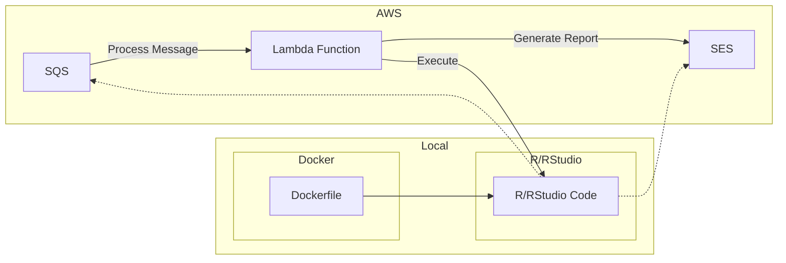

# DDH Web App: Report Generation

## Table of Contents
- [Introduction](#introduction)
- [Requirements](#Requirements)
- [Design Overview](#Design-Overview)
  - [System Architecture](#system-architecture)
  - [Local Environment](#local-environment)
  - [AWS Environment](#aws-environment)
- [Details](#Details)
  - [Email Generator](#email-generator)
- [Reference](#reference)

## Introduction
DDH Report Generator is a powerful software solution designed to streamline report generation and distribution. Built as a Lambda function, it seamlessly processes messages from an SQS (Simple Queue Service) and generates insightful reports based on the details contained within those messages. These reports are then automatically emailed to the intended recipients.

Our software offers flexibility in terms of its execution environment. While it is designed for deployment on AWS for production use, it can also be run locally using popular data analysis tools like R or RStudio. Additionally, for enhanced portability and reproducibility, you can leverage Docker to encapsulate the entire application and its dependencies.

With Lambda Report Generator, you can automate the report generation process, eliminating manual effort and ensuring accurate and timely results.

## Requirements

## Design Overview

### System Architecture

In the figure above, there are two main components: the local environment and the AWS environment.
+ The local environment can be either R/RStudio or Docker.
+ The AWS environment consists of an SQS (Simple Queue Service) and a Lambda function. 

The arrows in the figure represent the flow of data and dependencies between the components. The code interacts with the SQS to receive messages and with the SES to send the generated report. 

It also receives trigger events from the Lambda function when messages arrive in the SQS. 

### Local Environment
In the local environment, you can write the code in R or RStudio, which interacts with the SQS and SES services in AWS. Additionally, you have the option to use Docker for containerization, allowing you to package the code and its dependencies into a portable and reproducible container.

Dockerfile defines the configuration and dependencies required to run the code in a Docker container.

### AWS Environment
The SQS receives messages that need to be processed. These messages trigger the Lambda function, which executes the code written in R or RStudio. 

The code processes the details in the SQS message and generates a report. The report is then sent via SES (Simple Email Service) for emailing purposes.

