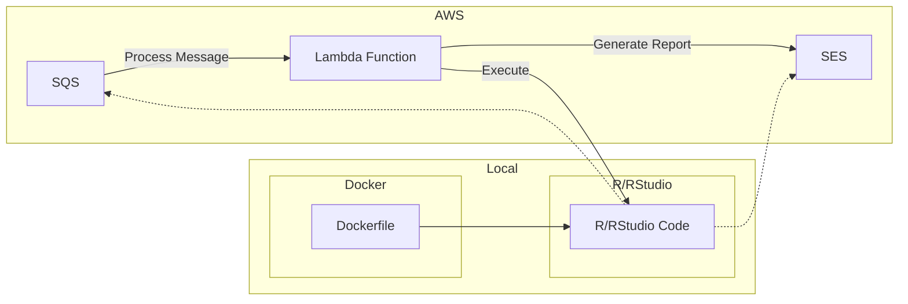

# DDH Web App: Report Generation

## Table of Contents
- [Introduction](#introduction)
- [Requirements](#Requirements)
- [Design Overview](#Design-Overview)
  - [System Architecture](#system-architecture)
  - [UML Diagram](#UML-Diagram)
- [Details](#Game-Detail)
- [Reference](#reference)

## Introduction

## Requirements

## Design Overview

### System Architecture

## Details

## Reference